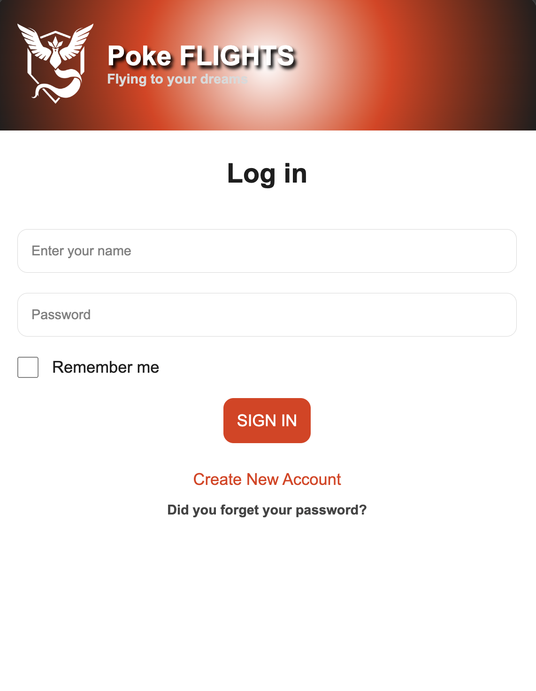
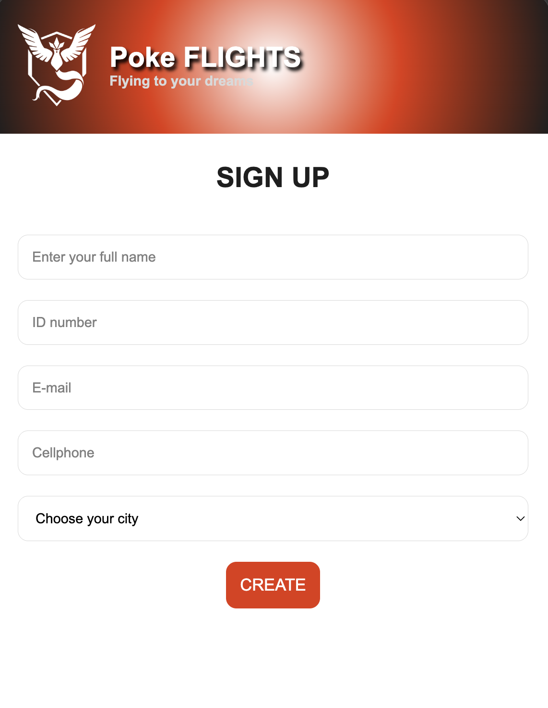
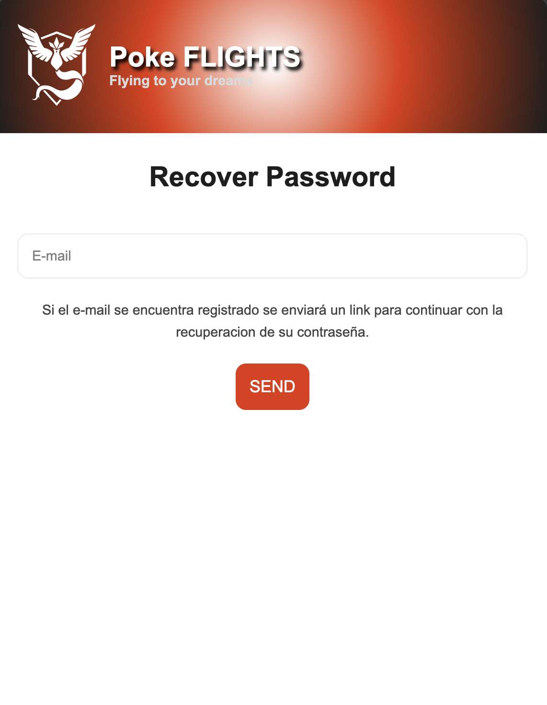
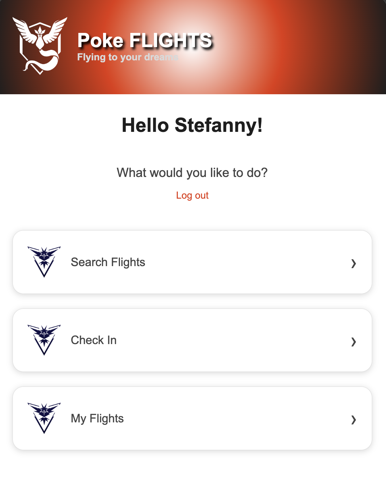
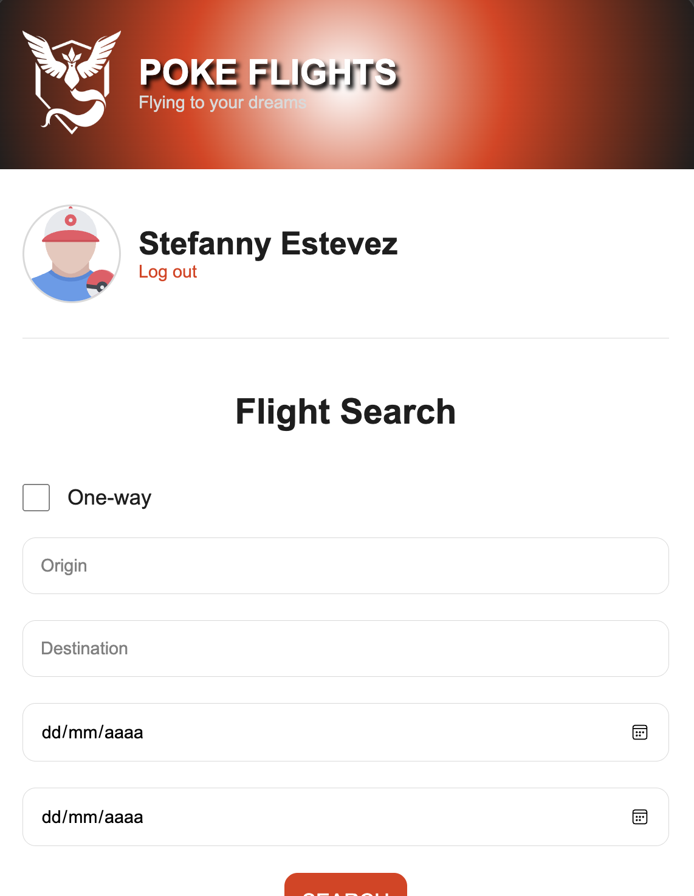
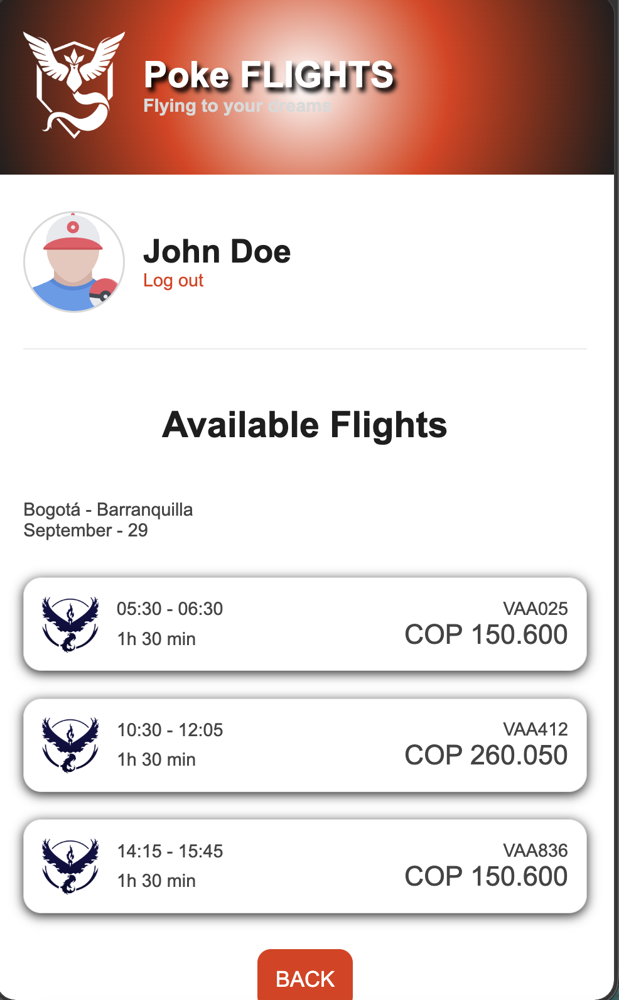
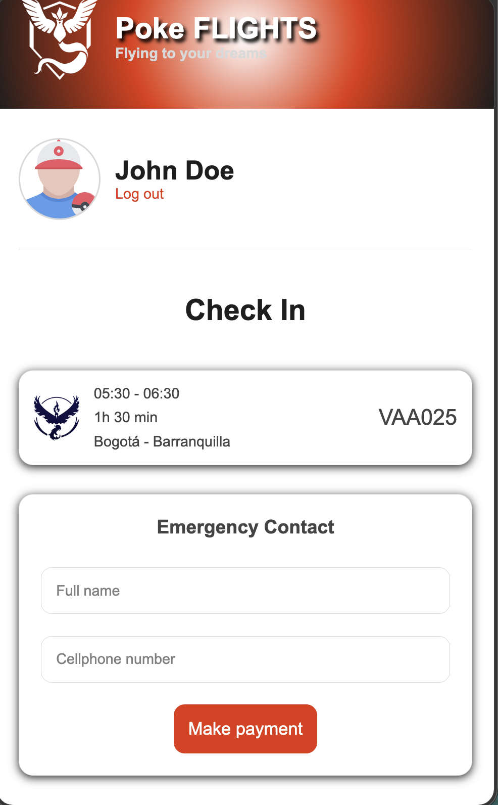
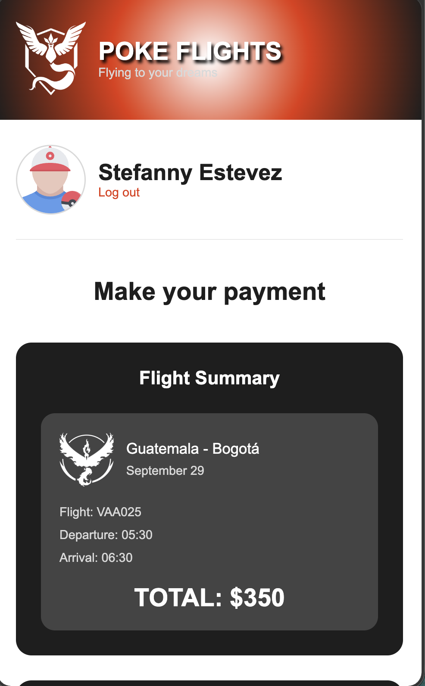

# Poke Flights

## Project Description

Poke Flights is a responsive application or program that was created and inspired by our dear professor Juan and Pokemon.
The project was developed using HTML and CSS with a mobile-first approach and responsive layouts to adapt to most device sizes.

### Main Features

- User authentication views
- Flight search system
- Dashboard interface
- Available flights section
- Check-in system
- Payment screen
- Responsiveness
- Animated pre-loading Pokemon transition

---

# Technologies Used

- HTML5
- CSS3

---

# Navigation Guide

## Login Page

Description:

The main page and index was assigned into the login page. This was originally called login, but it was changed to index.html to have pages functionality within GitHub.

### Screenshot

---

## Sign Up Page

Description:

On the sign up page you'll find an interface to fill out your information, and the button "Create" will direct you to the "Create a password page"
### Screenshot

---

## Recover Password Page

Description:

Recovering your password is easily accomplished by going to the "Sign-in" page and clicking "Did you forget your password"

### Screenshot

---

## Main Menu 

Description:

The Main Menu is the most adaptable, since the interface changes completely when you see it through your phone from what it really looks like on the desktop section. 

### Screenshot

---

## Flight Search

Description:

The flight search would allow us to input the origin and destination of the flight. Then by clicking on the SEARCH botton, it will direct you to the next view which is "Available Flights".

### Screenshot

---

## Available Flights

Description:

Available flights will show us a little display with some sample flights, and a button that goes back to the main menu.

### Screenshot

---

## Check-In Page

Description:

The Check-in page will show the page to buy a flight and a button that will show the page that will finally take us to the payment window.

### Screenshot

---

## Payment Gateway

Description:

The payment was the last part. This would allow users to enter their payment information and the button "Process Payment" will take them back to the Main Menu.
### Screenshot

---

# Responsive Design

The project includes responsive layouts for:

- Mobile devices
- Tablets 
- Desktop screens

The interface adapts using Flexbox, Grid, and CSS media queries.

---

# Author

Name:

Stefanny Estevez

GitHub:

https://github.com/StefannyEstevezSolares/
